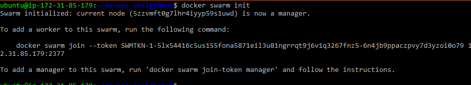
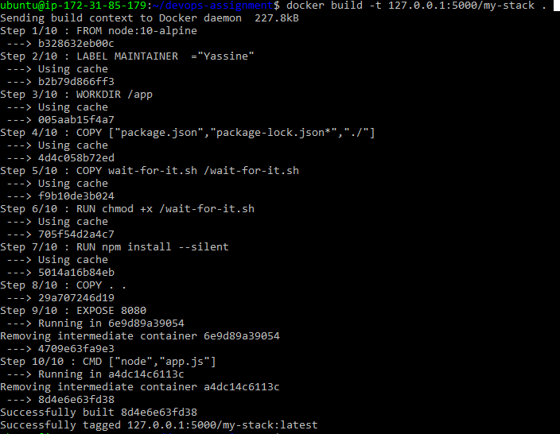
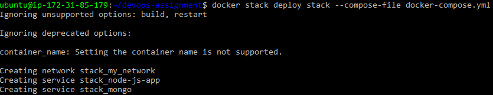
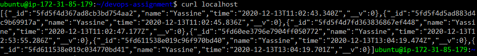
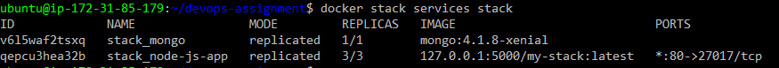

## How to run it

First on the host machine , initialize a docker swarm :

```bash
docker swarm init
```


you can add as many nodes to the swarm as u want with

```bash
docker swarm join --token TOKEN
```

then create a local registry to host our built image

```bash
docker run -d -p 5000:5000 --restart=always --name my-registry registry:2
```

cd to the project directory and build the node app to the registry

```bash
docker build -t 127.0.0.1:5000/my-stack .
```



run this command , to deploy the stack from docker-compose.yml and name it as stack

```bash
docker stack deploy stack --compose-file docker-compose.yml
```



## Checking

from the host machine run :

```bash
curl localhost
```

you should get a response from the server containing a list of connection times.


```bash
docker stack services stack
```


